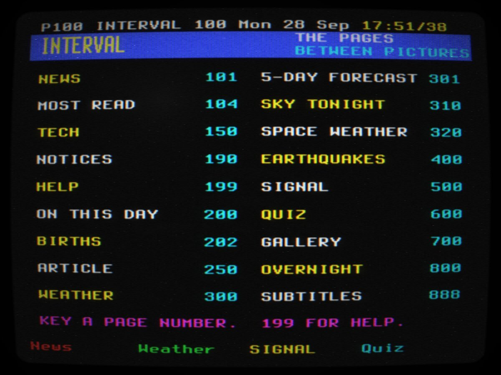
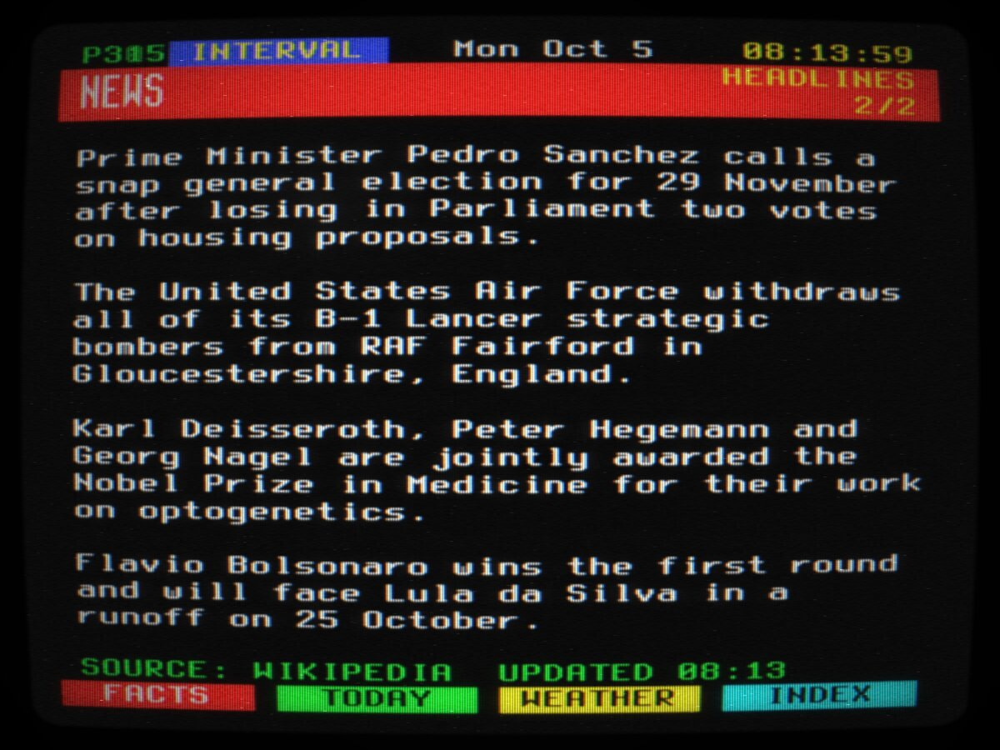

# INTERVAL

A teletext service for the SIGNAL network, on a simulated colour television.



Live pages of text: news, the most-read articles, tech, on this day,
weather for where you are, the moon tonight, space weather, earthquakes, and
the listings for [SIGNAL](https://hyphen8d.github.io/signal/)'s radio
stations. Key a page number and the set waits for your page to come round,
the header counting through the pages as they go past, the way a set did
when every page was broadcast in a loop.

## Using it

Press **P** (or tap, on a phone) to switch on. Then:

| key | does |
| --- | --- |
| 0-9 | key a page number. 100 is the index, 199 is help |
| up / down | next or previous page |
| left / right | step through a page's subpages |
| F1-F4, or Shift+1-4 | the red, green, yellow and cyan links on the bottom row |
| I | the index |
| R | reveal hidden answers |
| H | hold the page that is up |
| S | size: the top half, the bottom half, normal |
| C | colour, a black-and-white set, or a green monitor |
| N | overnight pages on or off |
| M | mute the overnight music |
| F | full screen |
| Esc | clear a half-keyed number |

On a phone the set comes with a remote control, and you can tap a page
number or a coloured key on the screen, or swipe: sideways for subpages,
up and down for pages.

Some things worth finding: page 310 (the moon, worked out on the set),
page 600 (a quiz, answers hidden), page 500 (SIGNAL's stations: the red key
on a station's page tunes SIGNAL in), and page 800, the overnight rotation,
which turns the pages by itself with a SIGNAL station playing underneath.
There are pages the index doesn't list. A remote control couldn't reach
them, but a keyboard can.



## Where the pages come from

Every source is keyless and open to browsers, because this is a static site
with no server behind it: Wikipedia (In the news, On this day, the featured
article, most read), USGS, NOAA's Space Weather Prediction Center,
Open-Meteo, Hacker News, and SIGNAL's own roster. When a source is late the
page says how old its copy is, and when one fails the page says it's off
air. The set never hides either.

The weather needs your location. The set asks once, when you press red on
page 300. Your position is kept in memory for the session and never stored.

## Running it locally

No build step and no dependencies.

```bash
python3 tools/dev-server.py 8000     # then open http://localhost:8000
npm test                             # the suite, headless, no network
npm run admin                        # the admin dashboard, http://127.0.0.1:8081/admin
```

`file://` does not work: the font is fetched, and that needs an origin.

## Credits

The CRT engine is [cyberspace-crt](https://github.com/unremarkablegarden/cyberspace-crt)
(MIT), with a colour plane added here. The font is Terminus (SIL OFL). Page
content belongs to its sources; see NOTICE.
